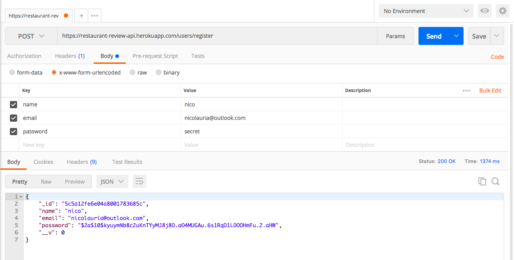

# Restaurant Review API
An application that mimics the api calls a restaurant review service would use 
The app is hosted on Heroku and can be tested with Postman 
[https://restaurant-review-api.herokuapp.com/](https://restaurant-review-api.herokuapp.com/)
***
## Dependencies
The following is an exhaustive list of dependencies

### Server/Database
**express** - web server 
**mongoose** - database/orm

### Authentication
**bcryptjs** - used to hash new passwords 
**jsonwebtoken** - used to store session information 
**passport** & **passport-jwt** - used to privatize certain routes

### Validation
**validator** - parse all post/put request data

### Middleware
**body-parser** - parse urlencoded data and make it available on req.body 
**multer** & **multer-s3** - parse form data and make it available on req.file & req.body

### APIS
**@google/maps** - convert physical address to lng/lat coordinates 
**aws-sdk** - used to store media files a Amazon S3 Bucket
***
## Routes
The api supports the routes listed below. I recommend using Postman to test the routes. Please use 'form-data' body type when creating a new review or editing an existing review. Otherwise use 'x-www-form-urlencoded'.  All received data is validated before any database submission. 
Below is one example of an invalid attempt to register a new user. Errors are returned as a JSON object.  

 The remaining routes below do not show examples of invalid requests but feel free to test the routes yourself.

### Users
`POST '/users/register'` - register a new user  

***
`POST '/users/login'` - login a user 
NOTE: you will need the token returned to access private routes  

***
### Reviews
`GET '/reviews'` - get all reviews  

***
`GET '/reviews/:longitude/:latitude/:dist` - get reviews within the dist of the location specified by the coordinates 
NOTE: the database is seeded with 100 reviews all within a 100 mile radius of the
San Francisco Ferry Building (longitude: -122.39606, latitude: 37.796156). The example
below uses these coordinates and finds all reviews within 10 miles. Feel free to change the distance to get more reviews.  

***
`POST '/reviews'` - create a new review 
you must first log in so that you can copy and paste the token returned 
you can either create a new user or use these credentials to log in: 
email: nicolauria@outlook.com 
password: secret 

add the authorization token as a header:
 
then you can add the new review information and submit 
NOTE: you must use form-data if you want to add an image (field name should be 'imgFile')  

***
`PUT '/reviews/:reviewId'` - update a review  

***
`DELETE '/reviews/:reviewId'` - delete a review 
NOTE: the deleted review is returned as JSON and could be used to update the state of our frontend  
  

That's it! I hope you enjoyed using the api.
